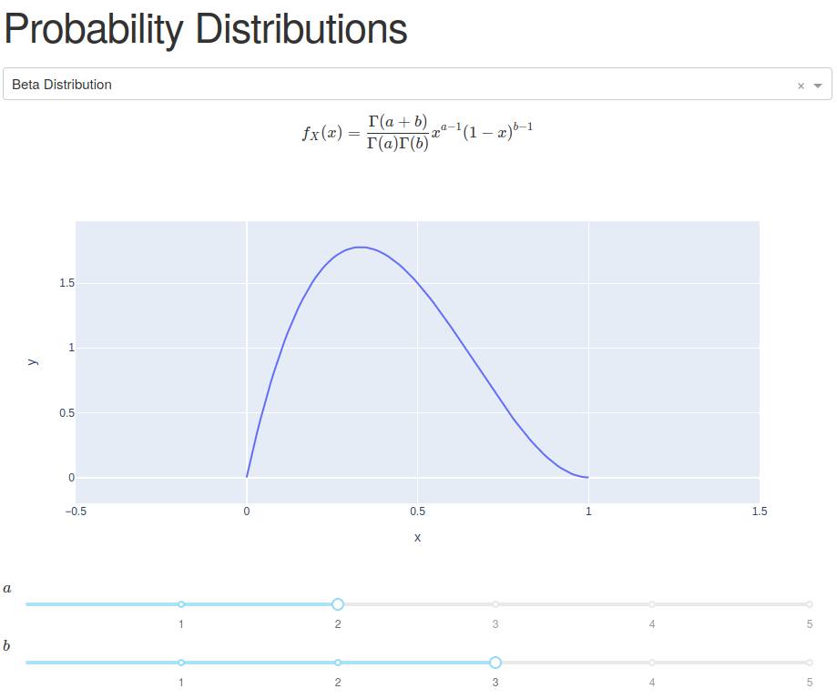

# distributions

This small [Dash](https://plot.ly/dash/open-source/) app lets you dynamically visualize the density / mass functions of various common probability distributions. Pick a distribution and play around with the parameters to see how they affect the shape of the density function.



## Usage

Make sure you have Python 3.6+ installed. First, clone and enter the repo.
Then, create a virtual environment and install the dependencies:
```
python3 -m venv .venv
source .venv/bin/activate
pip install -r requirements.txt
```
Finally, run the app:
```
python index.py
```
You can now access the app with your browser at `http://127.0.0.1:8050/`.